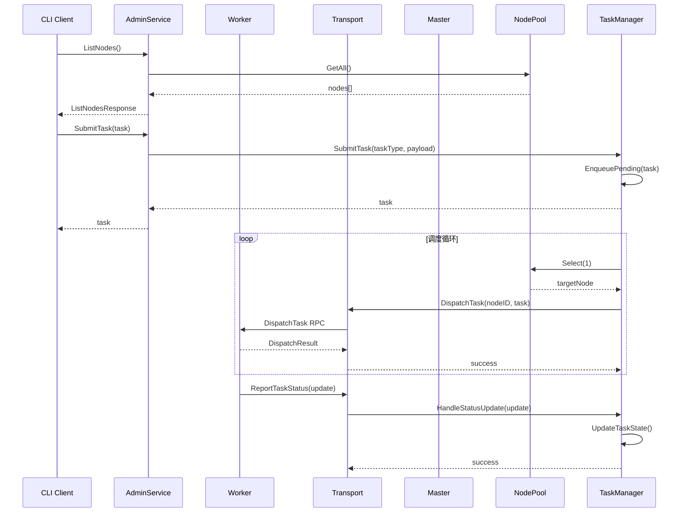
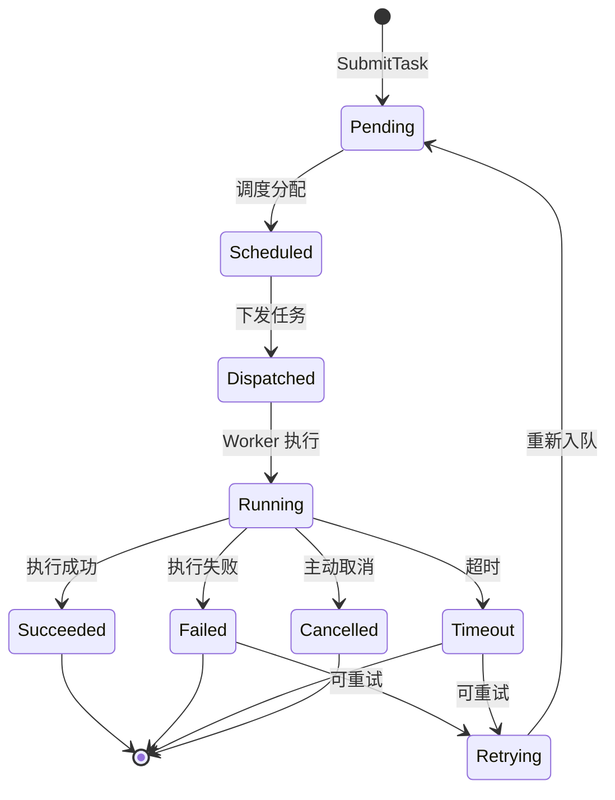
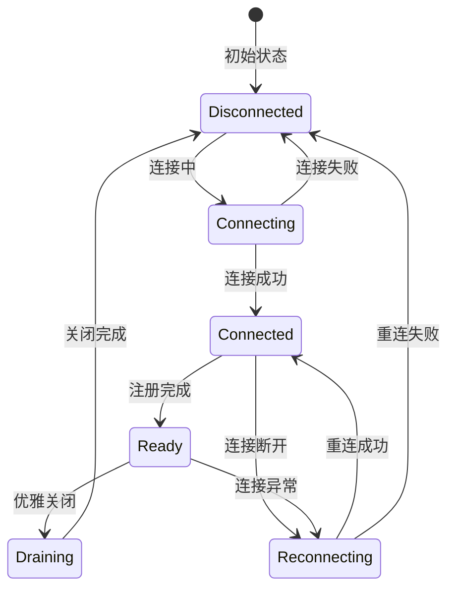

# go-distributed

[](https://github.com/kamalyes/go-distributed)
[](https://godoc.org/github.com/kamalyes/go-distributed)
[](https://github.com/kamalyes/go-distributed/blob/main/LICENSE)

🌐 一个通用的 Go 分布式任务调度系统，支持 Master-Worker 架构、gRPC/Redis 双协议、任务调度、健康检查、负载均衡等核心能力

## 🏗️ 架构设计

```mermaid
graph TB
    subgraph "应用层"
        CLI["CLI 客户端 kubectl 风格"]
        App1["go-stress 压测工具"]
        App2["go-scheduler 任务调度"]
        AppN["其他项目..."]
    end

    subgraph "go-distributed 核心层"
        subgraph "Master 节点"
            M[Master 主控制器]
            Pool[NodePool 节点池]
            Health[HealthChecker 健康检查]
            Selector[Selector 节点选择]
            TM[TaskManager 任务管理]
            Admin[AdminService 管理服务]
        end

        subgraph "Worker 节点"
            W[Worker 工作节点]
            Monitor[ResourceMonitor 资源监控]
            Stats[StatsBuffer 统计缓冲]
            Executor[TaskExecutor 任务执行]
            CM[ConnectionManager 连接管理]
        end

        subgraph "CLI 客户端"
            Client[Client gRPC 客户端]
            Reconnect[Reconnect 自动重连]
            Lifecycle[Lifecycle 生命周期]
        end

        subgraph "传输层（接口抽象）"
            Transport[Transport 接口]
            GRPC[gRPC 传输]
            Redis[Redis Pub/Sub 传输]
            Ext["未来扩展 NATS/Kafka/..."]
        end

        subgraph "公共层"
            NodeInfo[NodeInfo 节点模型]
            Config[配置管理]
            Token[令牌管理]
            Filter[节点过滤器]
            Task[Task 任务模型]
            State[状态机管理]
            Cluster[集群统计]
        end
    end

    CLI --> Admin
    App1 --> M
    App1 --> W
    App2 --> M
    App2 --> W
    AppN --> M
    AppN --> W

    M --> Pool
    M --> Health
    M --> Selector
    M --> TM
    M --> Admin
    M --> Transport

    W --> Monitor
    W --> Stats
    W --> Executor
    W --> CM
    W --> Transport

    Client --> Transport
    Client --> Reconnect
    Client --> Lifecycle

    Transport --> GRPC
    Transport --> Redis
    Transport --> Ext

    Pool --> NodeInfo
    TM --> Task
    M --> Config
    M --> Token
    Selector --> Filter
    Admin --> Cluster
    M --> State

    style Transport fill:#FF9800
    style GRPC fill:#4CAF50
    style Redis fill:#F44336
    style Ext fill:#9E9E9E
    style M fill:#2196F3
    style W fill:#2196F3
    style Client fill:#9C27B0
    style TM fill:#FF5722
```



### Master-Worker 通信流程



### 任务生命周期



### 连接生命周期



## ✨ 核心特性

| 特性 | 说明 |
|:-----|:-----|
| 🔌 **接口化传输层** | `MasterTransport` / `WorkerTransport` 接口抽象，支持 gRPC、Redis 双协议 |
| 🏭 **工厂模式** | `TransportFactory` 统一创建传输层实例，便于依赖注入和扩展 |
| 🧬 **泛型设计** | `Master[T]` / `Worker[T]` 泛型支持，适配不同业务场景的节点类型 |
| 📋 **任务管理** | 完整的任务生命周期管理（提交、调度、下发、追踪、重试、超时） |
| 💾 **持久化存储** | `TaskStore` 接口抽象，支持 Memory/Redis 双后端，Master 宕机可恢复 |
| 💓 **健康检查** | 可配置的心跳超时检测、失败计数、自动标记不健康/恢复 |
| ⚖️ **负载均衡** | 4 种节点选择策略：Random / LeastLoaded / LocationAware / RoundRobin |
| 📊 **资源监控** | 实时采集 CPU、内存、网络、负载等指标 |
| 🔐 **令牌管理** | 基于 `go-toolbox/sign` 的 JWT 令牌签发与验证 |
| 🎯 **节点过滤** | 支持区域、标签、资源限制等多维度过滤 |
| 📦 **统计缓冲** | `StatsBuffer[T]` 泛型缓冲区，批量刷写统计数据 |
| 🖥️ **CLI 客户端** | kubectl 风格的命令行客户端，支持 ListNodes、GetClusterStats、ListTasks、DrainNode |
| 🔄 **自动重连** | 指数退避 + 随机抖动的重连策略，防止惊群效应 |
| 📈 **集群统计** | 实时收集节点状态、区域分布、资源使用率等统计信息 |

## 📦 快速开始

### 安装

```bash
go get github.com/kamalyes/go-distributed
```

### Proto 代码生成

如果修改了 `proto/distributed.proto` 文件，需要重新生成 Go 代码：

```bash
# 前置依赖：安装 protoc 编译器和 Go 插件
# 1. 安装 protoc（参考 https://grpc.io/docs/protoc-installation/）
# 2. 安装 Go 插件
go install google.golang.org/protobuf/cmd/protoc-gen-go@latest
go install google.golang.org/grpc/cmd/protoc-gen-go-grpc@latest

# 在项目根目录执行生成脚本
bash proto/generate.sh

# 生成完成后验证编译
go build ./...
```

> **注意**：`generate.sh` 会在 `proto/` 目录下生成 `distributed.pb.go` 和 `distributed_grpc.pb.go` 两个文件，请勿手动编辑这些生成文件。

### Master 端示例

```go
package main

import (
    "context"
    "fmt"

    "github.com/kamalyes/go-distributed/common"
    "github.com/kamalyes/go-distributed/logger"
    "github.com/kamalyes/go-distributed/master"
)

func main() {
    log := logger.NewDistributedLogger("master")

    // 定义节点转换器：将通用 NodeInfo 转换为具体类型
    converter := func(info common.NodeInfo) (*common.BaseNodeInfo, error) {
        base, ok := info.(*common.BaseNodeInfo)
        if !ok {
            return nil, errorx.WrapError("invalid node type")
        }
        return base, nil
    }

    // 创建 Master（使用 gRPC 传输）
    m, err := master.NewMaster[*common.BaseNodeInfo](&common.MasterConfig{
        GRPCPort:          9000,
        TransportType:      common.TransportTypeGRPC,
        HeartbeatInterval:  5 * time.Second,
        HeartbeatTimeout:   15 * time.Second,
        MaxFailures:        3,
    }, converter, master.NewMemoryTaskStore(log), log)
    if err != nil {
        log.Fatal(err.Error())
    }

    // 启动 Master
    if err := m.Start(context.Background()); err != nil {
        log.Fatal(err.Error())
    }
    defer m.Stop()

    // 查看节点池
    log.InfoKV("Healthy nodes", "count", m.GetPool().Count())

    select {}
}
```

### Worker 端示例

```go
package main

import (
    "context"

    "github.com/kamalyes/go-distributed/common"
    "github.com/kamalyes/go-distributed/logger"
    "github.com/kamalyes/go-distributed/worker"
)

func main() {
    log := logger.NewDistributedLogger("worker")

    // 创建 Worker（使用 gRPC 传输）
    w, err := worker.NewWorker[*common.BaseNodeInfo](&common.WorkerConfig{
        WorkerID:       "worker-1",
        MasterAddr:     "localhost:9000",
        TransportType:   common.TransportTypeGRPC,
        ResourceMonitor: true,
    }, func() *common.BaseNodeInfo {
        return &common.BaseNodeInfo{}
    }, log)
    if err != nil {
        log.Fatal(err.Error())
    }

    // 启动 Worker（自动注册 + 心跳）
    if err := w.Start(context.Background()); err != nil {
        log.Fatal(err.Error())
    }
    defer w.Stop()

    select {}
}
```

### CLI 客户端示例

```go
package main

import (
    "context"
    "fmt"
    "time"

    "github.com/kamalyes/go-distributed/cli"
    "github.com/kamalyes/go-distributed/common"
    "github.com/kamalyes/go-distributed/logger"
    "github.com/kamalyes/go-distributed/proto"
)

func main() {
    log := logger.NewDistributedLogger("cli")

    // 创建 CLI 客户端
    client, err := cli.NewClient("localhost:9000",
        cli.WithLogger(log),
        cli.WithReconnectPolicy(common.DefaultReconnectPolicy()),
        cli.WithHealthCheckInterval(5*time.Second),
    )
    if err != nil {
        log.Fatal(err.Error())
    }
    defer client.Close()

    // 启动客户端（自动健康检查 + 重连）
    if err := client.Start(context.Background()); err != nil {
        log.Fatal(err.Error())
    }
    defer client.Stop()

    // 等待连接就绪
    if err := client.WaitReady(context.Background(), 10*time.Second); err != nil {
        log.Fatal(err.Error())
    }

    // 列出所有节点（类似 kubectl get nodes）
    resp, err := client.ListNodes(context.Background(), &pb.ListNodesRequest{})
    if err != nil {
        log.Fatal(err.Error())
    }

    log.InfoKV("Total nodes", "count", resp.TotalCount)
    for _, node := range resp.Nodes {
        log.InfoKV("Node info", "id", node.NodeInfo.NodeId, "state", node.State, "hostname", node.NodeInfo.Hostname)
    }

    // 获取集群统计（类似 kubectl top nodes）
    stats, err := client.GetClusterStats(context.Background(), &pb.ClusterStatsRequest{
        IncludeResourceStats: true,
        IncludeTaskStats:     true,
    })
    if err != nil {
        log.Fatal(err.Error())
    }

    log.Info("Cluster stats:")
    log.InfoKV("Total nodes", "count", stats.TotalNodes)
    log.InfoKV("Healthy nodes", "count", stats.HealthyNodes)
    log.InfoKV("Offline nodes", "count", stats.OfflineNodes)
    log.InfoKV("Avg CPU", "percent", stats.AvgCpuUsage)
    log.InfoKV("Avg Memory", "percent", stats.AvgMemoryUsage)

    // 列出任务（类似 kubectl get jobs）
    tasks, err := client.ListTasks(context.Background(), &pb.ListTasksRequest{})
    if err != nil {
        log.Fatal(err.Error())
    }

    log.InfoKV("Total tasks", "count", tasks.TotalCount)
    for _, task := range tasks.Tasks {
        log.InfoKV("Task info", "id", task.TaskId, "state", task.State, "type", task.TaskType)
    }
}
```

### 完整示例：任务提交与消费

我们提供了一个完整的分布式任务系统示例，包含Master节点和Worker节点，演示任务的提交、调度、执行和监控。

**示例位置：** [examples/](examples/)

**功能特性：**

- Master节点：任务提交、状态监控、任务管理
- Worker节点：任务消费、进度上报、多种任务处理器
- 支持3种任务类型：Command、HTTP、Custom
- 实时进度上报和状态更新
- 任务取消和重试机制

**详细文档：** 查看 [examples/README.md](examples/README.md) 获取完整的使用说明、API文档和执行流程图。

### 使用 Redis 传输

```go
// Master 端 - 切换为 Redis 传输
m, _ := master.NewMaster[*common.BaseNodeInfo](&common.MasterConfig{
    TransportType:  common.TransportTypeRedis,
    RedisAddr:      "localhost:6379",
    RedisPassword:  "",
    RedisDB:        0,
}, converter, store, log)

// Worker 端 - 切换为 Redis 传输
w, _ := worker.NewWorker[*common.BaseNodeInfo](&common.WorkerConfig{
    WorkerID:      "worker-1",
    TransportType:  common.TransportTypeRedis,
    RedisAddr:      "localhost:6379",
    RedisPassword:  "",
    RedisDB:        0,
}, func() *common.BaseNodeInfo {
    return &common.BaseNodeInfo{}
}, log)
```

### 使用 Redis 任务存储

```go
import "github.com/redis/go-redis/v9"

// 创建 Redis 客户端
redisClient := redis.NewUniversalClient(&redis.UniversalOptions{
    Addrs:    []string{"localhost:6379"},
    Password: "",
    DB:       0,
})

// 创建 Redis 任务存储
store := master.NewRedisTaskStore(redisClient, log)

// 传递给 Master
m, _ := master.NewMaster[*common.BaseNodeInfo](config, converter, store, log)
```

### 自定义节点类型

```go
// 1. 定义业务节点类型（嵌入 BaseNodeInfo）
type SchedulerNode struct {
    common.BaseNodeInfo
    RunningJobs []string // 扩展字段：正在运行的任务
    MaxJobs     int      // 扩展字段：最大任务数
}

// 2. Master 端 - 使用自定义节点类型
converter := func(info common.NodeInfo) (*SchedulerNode, error) {
    base, ok := info.(*common.BaseNodeInfo)
    if !ok {
        return nil, errorx.WrapError("invalid node type")
    }
    return &SchedulerNode{
        BaseNodeInfo: *base,
        MaxJobs:      10,
    }, nil
}

m, _ := master.NewMaster[*SchedulerNode](config, converter, store, log)

// 3. Worker 端 - 使用自定义节点类型
w, _ := worker.NewWorker[*SchedulerNode](workerConfig, func() *SchedulerNode {
    return &SchedulerNode{MaxJobs: 10}
}, log)
```

## 🔌 传输层扩展

通过实现 `TransportFactory` 接口，可以轻松扩展新的通信协议：

```go
// 实现 TransportFactory 接口
type NATSTransportFactory struct{}

func (f *NATSTransportFactory) CreateMasterTransport(config *common.MasterConfig, log logger.ILogger) (MasterTransport, error) {
    return NewNATSMasterTransport(config, log), nil
}

func (f *NATSTransportFactory) CreateWorkerTransport(config *common.WorkerConfig, log logger.ILogger) (WorkerTransport, error) {
    return NewNATSWorkerTransport(config, log), nil
}

func (f *NATSTransportFactory) Type() common.TransportType {
    return "nats"
}
```

## 📊 节点选择策略

| 策略 | 说明 | 适用场景 |
|:-----|:-----|:---------|
| `SelectStrategyRandom` | 随机选择 | 简单负载均衡 |
| `SelectStrategyLeastLoaded` | 最小负载优先 | 资源敏感型任务 |
| `SelectStrategyLocationAware` | 区域感知优先 | 跨区域部署 |
| `SelectStrategyRoundRobin` | 轮询选择 | 均匀分配任务 |

```go
// 使用区域感知选择器
selector := master.NewSelector[*common.BaseNodeInfo](
    common.SelectStrategyLocationAware,
    []string{"beijing", "shanghai"}, // 优先区域
)
```

## 📁 项目结构

```bash
go-distributed/
├── cli/                 # 🖥️ CLI 客户端
│   ├── client.go        # Client gRPC 客户端
│   ├── admin.go         # AdminService API 调用
│   ├── lifecycle.go     # 连接生命周期管理
│   ├── reconnect.go     # 自动重连与健康检查
│   └── client_test.go  # 集成测试
├── common/              # 📦 公共类型与接口
│   ├── node.go          # NodeInfo 接口 + BaseNodeInfo 基础实现
│   ├── states.go        # NodeState / ConnectionState 状态枚举
│   ├── configs.go       # MasterConfig / WorkerConfig 配置
│   ├── strategy.go      # SelectStrategy / TransportType 常量
│   ├── filter.go        # NodeFilter 节点过滤器
│   ├── resource.go      # ResourceUsage 资源使用率
│   ├── task.go          # TaskInfo 任务信息模型
│   ├── task_state.go    # TaskState 任务状态枚举 + 状态机
│   ├── connection.go    # ConnectionState + ReconnectPolicy 连接生命周期
│   ├── cluster.go       # ClusterStatsCollector 集群统计收集器
│   ├── convert.go       # Proto ↔ Common 类型转换
│   ├── token.go        # TokenManager 令牌管理
│   └── errors.go       # 统一错误常量
├── transport/           # 🔌 传输层（接口 + 双实现）
│   ├── transport.go     # MasterTransport / WorkerTransport / TransportFactory 接口
│   ├── grpc.go          # gRPC 传输实现 + GRPCTransportFactory
│   ├── redis.go         # Redis Pub/Sub 传输实现 + RedisTransportFactory
│   ├── grpc_test.go    # gRPC 传输单元测试
│   └── redis_test.go   # Redis 传输单元测试
├── master/              # 🎛️ Master 节点
│   ├── master.go        # Master[T] 泛型主节点
│   ├── pool.go          # NodePool[T] 节点池
│   ├── health.go        # HealthChecker[T] 健康检查
│   ├── selector.go      # 节点选择策略（4 种）
│   ├── task_manager.go  # TaskManager 任务管理器
│   ├── task_store.go    # TaskStore 任务存储接口 + Memory/Redis 实现
│   ├── admin_service.go # AdminService 管理服务
│   └── *_test.go       # 各模块单元测试
├── worker/              # ⚙️ Worker 节点
│   ├── worker.go        # Worker[T] 泛型工作节点
│   ├── monitor.go       # ResourceMonitor 资源监控
│   ├── stats_buffer.go  # StatsBuffer[T] 统计缓冲区
│   ├── task_executor.go # TaskExecutor 任务执行器
│   ├── connection_manager.go # ConnectionManager 连接管理
│   └── *_test.go       # 各模块单元测试
├── proto/               # 📡 gRPC Proto 定义
│   ├── distributed.proto         # 服务定义
│   ├── distributed.pb.go         # 生成的消息代码
│   ├── distributed_grpc.pb.go    # 生成的 gRPC 服务代码
│   └── generate.sh              # Proto 代码生成脚本
├── logger/              # 📝 日志适配
│   ├── logger.go        # ILogger 类型别名 + 工厂函数
│   └── logger_test.go  # 日志单元测试
└── README.md            # 📄 项目文档
```

## 🛠️ 技术栈

| 组件 | 说明 |
|------|------|
| **传输协议** | gRPC (google.golang.org/grpc) / Redis (go-redis/v9) |
| **签名认证** | go-toolbox/sign (JWT 令牌) |
| **并发安全** | go-toolbox/syncx (Map, Bool, Locker, PeriodicTask, EventLoop) |
| **ID 生成** | go-toolbox/idgen (雪花算法) |
| **系统监控** | gopsutil (CPU/内存/网络/负载) |
| **日志** | go-logger |
| **测试框架** | testify (断言 + 测试套件) |

## 🧪 测试

项目包含完整的单元测试和集成测试：

```bash
# 运行所有测试
go test ./...

# 运行指定模块测试
go test ./master/...
go test ./worker/...
go test ./transport/...
go test ./cli/...

# 运行测试并显示覆盖率
go test -cover ./...

# 生成覆盖率报告
go test -coverprofile=coverage.out ./...
go tool cover -html=coverage.out
```

## 📈 性能优化

- **EventLoop 替代 for+select**：使用 `syncx.NewEventLoop` 实现事件驱动模式，减少 CPU 空转
- **批量刷写统计**：`StatsBuffer[T]` 支持按时间/大小/双策略批量刷写
- **连接池复用**：gRPC 连接复用，避免频繁建立/断开连接
- **Redis Pipeline**：批量执行 Redis 命令，减少网络往返
- **泛型零拷贝**：泛型设计避免接口装箱，减少内存分配

## 🤝 贡献

欢迎提交 Issue 和 Pull Request！

1. Fork 本仓库
2. 创建特性分支 (`git checkout -b feature/amazing-feature`)
3. 提交更改 (`git commit -m '✨ feat: Add amazing feature'`)
4. 推送到分支 (`git push origin feature/amazing-feature`)
5. 开启 Pull Request

### 代码规范

- 遵循 [Effective Go](https://go.dev/doc/effective_go) 最佳实践
- 使用 `gofmt` 格式化代码
- 运行 `go vet` 检查代码问题
- 使用 `gocognit` 检查认知复杂度（阈值 ≤ 15）
- 使用 `gocyclo` 检查圈复杂度（阈值 ≤ 10）

## 📄 许可证

[MIT License](LICENSE)

## 🙏 致谢

- [go-toolbox](https://github.com/kamalyes/go-toolbox) - 提供并发、日志、签名等基础工具
- [gopsutil](https://github.com/shirou/gopsutil) - 系统监控库
- [go-redis](https://github.com/redis/go-redis) - Redis 客户端
- [grpc-go](https://github.com/grpc/grpc-go) - gRPC Go 实现
