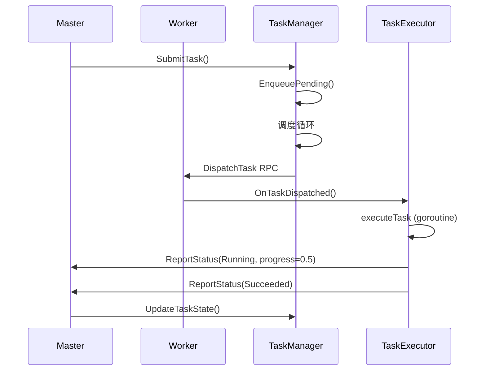
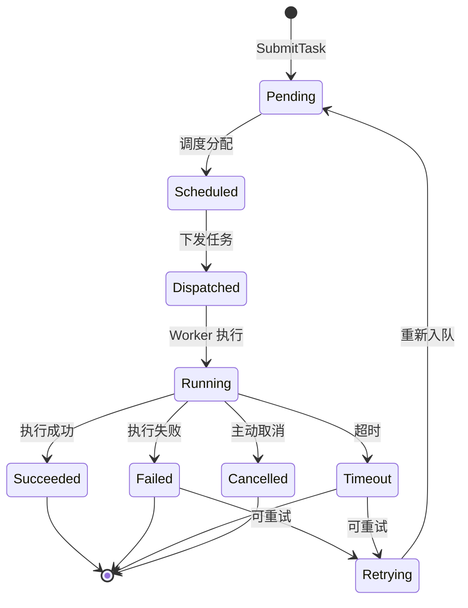

# Examples

本目录包含 go-distributed 项目的各种示例代码，帮助您快速理解和使用分布式任务系统

## 完整示例：任务提交与消费

这个示例展示了一个完整的分布式任务系统，包含Master节点和Worker节点，演示任务的提交、调度、执行和监控

### 功能特性

- Master节点：任务提交、状态监控、任务管理
- Worker节点：任务消费、进度上报、多种任务处理器
- 支持3种任务类型：Command、HTTP、Custom
- 实时进度上报和状态更新
- 任务取消和重试机制

### 项目结构

```bash
examples/
├── main.go           # Master 节点（任务提交端）
├── worker.go         # Worker 节点（任务消费端）
├── go.mod           # Go 模块定义
└── README.md         # 本文档
```

### 快速开始

#### 前置要求

- Go 1.25.0+
- 依赖 go-distributed 库

#### 安装依赖

```bash
cd examples
go mod tidy
```

#### 运行示例

需要同时启动Master和Worker节点：

##### 终端 1：启动 Master

```bash
cd examples
go run main.go
```

输出示例：

```bash
master  ℹ️ [INFO]  Node pool cleared
master  ℹ️ [INFO]  Worker connections cleared
master  ℹ️ [INFO]  gRPC master transport listening {port: 9001}
master  ℹ️ [INFO]  Task manager started
master  ℹ️ [INFO]  Health checker started {interval: 5s}
master  ℹ️ [INFO]  Master started successfully {transport: grpc, grpc_port: 9001}
master  ℹ️ [INFO]  Master started on port 9000
master  ℹ️ [INFO]  Master is running and generating tasks...
master  ℹ️ [INFO]  Master is running and generating tasks...
master  ℹ️ [INFO]  Task submitted {task_id: 569366162115268608, task_type: command, target_node: }
master  ℹ️ [INFO]  Task submitted {task_id: 569366162115268608, type: command, task_num: 3}
master  ℹ️ [INFO]  Task submitted {task_id: 569366162119462912, task_type: http, target_node: }
master  ℹ️ [INFO]  HTTP task submitted {task_id: 569366162119462912, type: http, task_num: 3}
master  ⚠️ [WARN]  No available nodes for task, re-queued {task_id: 569366162115268608}
```

##### 终端 2：启动 Worker

```bash
cd examples
go run worker.go
```

输出示例：

```bash
worker ℹ️ [INFO] Task handler registered {task_type: http}
worker ℹ️ [INFO] Task handler registered {task_type: custom}
worker ℹ️ [INFO] Task handler registered {task_type: command}
worker ℹ️ [INFO] Connection attempt succeeded {addr: localhost:9001}
worker ℹ️ [INFO] Connected to master via gRPC {addr: localhost:9001}
worker ⚠️ [WARN] Registration attempt failed, will retry {attempt: 1, remaining: 4, max_retries: 5, retry_interval: 1s, backoff_multiplier: 1.50, error: register failed: rpc e
rror: code = DeadlineExceeded desc = context deadline exceeded}
worker ℹ️ [INFO] Registration attempt succeeded {worker_id: worker-h1lst3ti-a4qa-71f7-5t81-er1ys02vrjg3}
worker ℹ️ [INFO] Registered successfully {worker_id: worker-h1lst3ti-a4qa-71f7-5t81-er1ys02vrjg3, token: eyJBbGciOiJTSEEyNTYiLCJTZW5kIjoiSDBtUlAxSEl4eU9KM2pEaiIsIklzc3VlciI6Im
dvLWRpc3RyaWJ1dGVkLW1hc3RlciIsIklzc3VlZEF0IjoxNzc2NzQyNjg3MDU3OTUyLCJFeHBpcmF0aW9uIjoxNzc2ODI5MDg3MDU3OTUyfQ.eyJub2RlX2lkIjoid29ya2VyLWgxbHN0M3RpLWE0cWEtNzFmNy01dDgxLWVyMXlzMDJ2cmpnMyJ9.7EiugpptagpHpTLKY6
xzz-_vXGtjqChf44EV79OF_Gs, heartbeat_interval: 5}
worker ℹ️ [INFO] Worker started successfully {worker_id: worker-h1lst3ti-a4qa-71f7-5t81-er1ys02vrjg3, transport: grpc, master_addr: localhost:9001}
worker ℹ️ [INFO] Worker started and ready to receive tasks
worker ℹ️ [INFO] Task dispatched via stream {task_id: 569366162115268608, accepted: true}
worker ℹ️ [INFO] Executing command task {task_id: 569366162115268608, command: echo 'Hello from task 3'}
worker ℹ️ [INFO] Task dispatched via stream {task_id: 569366204054114304, accepted: true}
worker ℹ️ [INFO] Executing command task {task_id: 569366204054114304, command: echo 'Hello from task 5'}
worker ℹ️ [INFO] Task dispatched via stream {task_id: 569366183082594304, accepted: true}
worker ℹ️ [INFO] Executing command task {task_id: 569366183082594304, command: echo 'Hello from task 4'}
worker ℹ️ [INFO] Task dispatched via stream {task_id: 569366225025634304, accepted: true}
worker ℹ️ [INFO] Executing command task {task_id: 569366225025634304, command: echo 'Hello from task 6'}
worker ℹ️ [INFO] Task dispatched via stream {task_id: 569366225034022912, accepted: true}
worker ℹ️ [INFO] Executing HTTP task {task_id: 569366225034022912, url: {"url": "http://example.com", "method": "GET", "timeout": 10}}
worker ℹ️ [INFO] Task dispatched via stream {task_id: 569366162119462912, accepted: true}
worker ℹ️ [INFO] Executing HTTP task {task_id: 569366162119462912, url: {"url": "http://example.com", "method": "GET", "timeout": 10}}
worker ℹ️ [INFO] HTTP task completed {task_id: 569366225034022912, result: HTTP request completed: {"url": "http://example.com", "method": "GET", "timeout": 10}}
worker ℹ️ [INFO] Task completed {task_id: 569366225034022912, state: succeeded}
worker ℹ️ [INFO] HTTP task completed {task_id: 569366162119462912, result: HTTP request completed: {"url": "http://example.com", "method": "GET", "timeout": 10}}
worker ℹ️ [INFO] Task completed {task_id: 569366162119462912, state: succeeded}
worker ℹ️ [INFO] Command executed successfully {task_id: 569366183082594304, result: Command executed: echo 'Hello from task 4'}
worker ℹ️ [INFO] Command executed successfully {task_id: 569366225025634304, result: Command executed: echo 'Hello from task 6'}
worker ℹ️ [INFO] Command executed successfully {task_id: 569366204054114304, result: Command executed: echo 'Hello from task 5'}
worker ℹ️ [INFO] Command executed successfully {task_id: 569366162115268608, result: Command executed: echo 'Hello from task 3'}
worker ℹ️ [INFO] Task completed {task_id: 569366183082594304, state: succeeded}
worker ℹ️ [INFO] Task completed {task_id: 569366225025634304, state: succeeded}
worker ℹ️ [INFO] Task completed {task_id: 569366204054114304, state: succeeded}
worker ℹ️ [INFO] Task completed {task_id: 569366162115268608, state: succeeded}
```

### 任务类型说明

#### 1. Command 任务

执行命令行任务，模拟执行shell命令

**示例：**

```go
task, _ := m.GetTaskManager().SubmitTask(
    common.TaskTypeCommand,
    []byte("echo 'Hello, World!'") ,
)
```

**Worker处理：**

- 模拟命令执行（sleep 2秒）
- 上报50%进度
- 完成后返回执行结果

#### 2. HTTP 任务

执行HTTP请求任务，模拟调用外部API

**示例：**

```go
task, _ := m.GetTaskManager().SubmitTask(
    common.TaskTypeHTTP,
    []byte("https://api.example.com/data") ,
)
```

**Worker处理：**

- 模拟HTTP请求（sleep 3秒）
- 返回请求结果

#### 3. Custom 任务

自定义业务逻辑任务，支持进度上报

**示例：**

```go
task, _ := m.GetTaskManager().SubmitTask(
    common.TaskTypeCustom,
    []byte("custom-business-logic") ,
)
```

**Worker处理：**

- 执行10次迭代
- 每次迭代上报10%进度
- 支持任务取消

### Master 节点详解

#### 配置说明

```go
m, _ := master.NewMaster[*common.BaseNodeInfo](&common.MasterConfig{
    GRPCPort:          9000,              // gRPC 端口
    TransportType:      common.TransportTypeGRPC, // 传输类型
    HeartbeatInterval:  5 * time.Second,   // 心跳间隔
    HeartbeatTimeout:   15 * time.Second,  // 心跳超时
    MaxFailures:        3,                  // 最大失败次数
    // 安全认证配置（可选）
    EnableAuth:      true,                  // 启用安全认证
    Secret:          "your-jwt-secret",     // JWT 签名密钥
    TokenExpiration: 24 * time.Hour,        // 令牌过期时间
    JoinSecrets: []*common.JoinSecretEntry{ // Worker 加入集群的预共享密钥
        {
            TokenID:     "abcdef",
            Secret:      "0123456789abcdef",
            ExpireAt:    time.Now().Add(24 * time.Hour),
            MaxUsages:   10,
            Description: "default join token",
        },
    },
}, converter, store, log)
```

#### 任务提交选项

```go
task, _ := m.GetTaskManager().SubmitTask(
    common.TaskTypeCommand,           // 任务类型
    []byte("payload"),                // 任务数据
    master.WithPriority(10),          // 优先级
    master.WithTimeout(30*time.Second), // 超时时间
    master.WithMaxRetries(3),         // 最大重试次数
    master.WithMetadata(map[string]string{ // 元数据
        "owner": "user1",
        "env":   "production",
    }),
)
```

#### 任务状态监控

```go
ticker := time.NewTicker(2 * time.Second)
defer ticker.Stop()

for {
    select {
    case <-ticker.C:
        taskInfo, _ := m.GetTaskManager().GetTask(task.ID)
        log.InfoKV("Task status",
            "state", taskInfo.State,
            "progress", taskInfo.Progress,
            "retry_count", taskInfo.RetryCount,
        )
    }
}
```

### Worker 节点详解

#### 配置说明

```go
w, _ := worker.NewWorker[*common.BaseNodeInfo](&common.WorkerConfig{
    WorkerID:         "worker-1",               // Worker ID
    MasterAddr:       "localhost:9000",         // Master 地址
    TransportType:     common.TransportTypeGRPC,   // 传输类型
    ResourceMonitor:   true,                      // 启用资源监控
    MaxConcurrentTasks: 10,                        // 最大并发任务数
    // 安全认证配置（与 Master 的 EnableAuth 对应）
    EnableAuth:  true,                             // 启用安全认证
    JoinSecret:  "abcdef.0123456789abcdef",        // <token-id>.<secret> 格式
}, nodeFactory, log)
```

#### 任务处理器注册

```go
executor := w.GetTaskExecutor()

// 注册 Command 处理器
executor.RegisterHandlerFunc(common.TaskTypeCommand, func(ctx context.Context, task *common.TaskInfo) *common.TaskResult {
    // 任务执行逻辑
    result := executeTask(task)
    
    // 返回结果
    return &common.TaskResult{
        Data:  []byte(result),
        Error: "",
    }
})
```

#### 进度上报

```go
executor.ReportProgress(task.ID, 0.5) // 上报50%进度
```

#### 任务取消检查

```go
if ctx.Err() == context.Canceled {
    log.InfoKV("Task cancelled", "task_id", task.ID)
    return nil
}
```

### 执行流程



### 任务生命周期



### 常见问题

#### Q: Worker 无法连接到 Master？

A: 检查以下几点：

1. Master 是否已启动（端口9000）
2. Worker 的 MasterAddr 配置是否正确
3. 防火墙是否允许连接
4. 如果 Master 启用了安全认证（`EnableAuth: true`），Worker 也需要配置对应的 `EnableAuth` 和 `JoinSecret`

#### Q: Worker 注册失败提示认证错误？

A: 检查以下几点：

1. Master 的 `EnableAuth` 是否为 `true`
2. Worker 的 `JoinSecret` 格式是否正确（`<token-id>.<secret>`）
3. JoinSecret 是否已过期（检查 `ExpireAt`）
4. JoinSecret 使用次数是否已达上限（检查 `MaxUsages` 和 `UsedCount`）

#### Q: 任务一直处于 Pending 状态？

A: 可能原因：

1. Worker 未注册或已断开
2. 节点选择器没有找到合适的节点
3. 节点状态不健康

#### Q: 如何查看任务详情？

A: 使用 CLI 客户端：

```bash
cd go-distributed
go run examples/cli/main.go list-tasks
```

#### Q: 如何取消正在运行的任务？

A: 使用 Master API：

```go
err := m.GetTaskManager().CancelTask(taskID)
```

### 扩展建议

#### 添加新的任务类型

1. 在 Worker 端注册新的处理器：

```go
executor.RegisterHandlerFunc(common.TaskType("new-type"), func(ctx context.Context, task *common.TaskInfo) (*common.TaskResult, error) {
    // 实现新的任务逻辑
})
```

1. 在 Master 端提交新类型任务：

```go
m.GetTaskManager().SubmitTask(common.TaskType("new-type"), payload)
```

#### 使用 Redis 传输

修改配置：

```go
// Master
m, _ := master.NewMaster[*common.BaseNodeInfo](&common.MasterConfig{
    TransportType: common.TransportTypeRedis,
    RedisAddr:     "localhost:6379",
    // ...
}, converter, store, log)

// Worker
w, _ := worker.NewWorker[*common.BaseNodeInfo](&common.WorkerConfig{
    TransportType: common.TransportTypeRedis,
    RedisAddr:     "localhost:6379",
    // ...
}, nodeFactory, log)
```

## 示例最佳实践

### 1. 错误处理

所有示例都包含完善的错误处理：

```go
if err != nil {
    log.Fatal(err.Error())
}
```

### 2. 优雅关闭

使用 `defer` 确保资源正确释放：

```go
if err := m.Start(context.Background()); err != nil {
    log.Fatal(err.Error())
}
defer m.Stop()
```

### 3. 日志记录

使用结构化日志记录关键信息：

```go
log.InfoKV("Task submitted", "task_id", task.ID, "type", task.Type)
```

### 4. 上下文使用

使用 context.Context 支持任务取消：

```go
if ctx.Err() == context.Canceled {
    log.InfoKV("Task cancelled", "task_id", task.ID)
    return nil
}
```

## 贡献示例

欢迎提交新的示例！请遵循以下规范：

1. 在 examples/ 下创建新的目录（如果需要）
2. 包含完整的代码和 README 文档
3. 添加必要的错误处理和日志记录
4. 确保代码可以正常运行

## 相关文档

- [go-distributed 主 README](../README.md)
- [Master API 文档](../master/README.md)
- [Worker API 文档](../worker/README.md)
- [CLI 客户端文档](../cli/README.md)

## 许可证

MIT License
